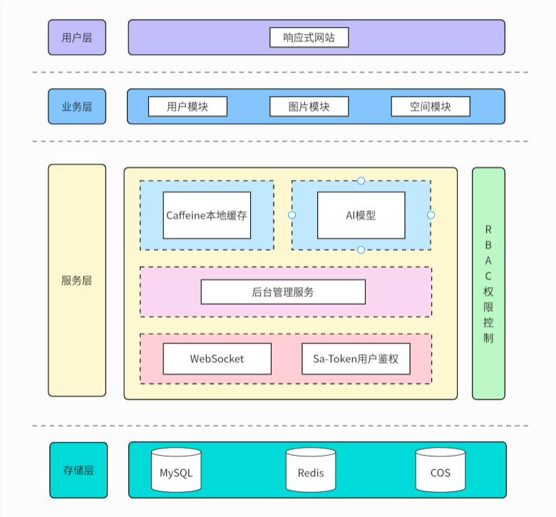

# 林语图片协作平台项目介绍
> 作者：林语
## 项目介绍

基于SpringBoot + Redis + COS + AI + WebSocket的图片协作平台平台。
分为公共图库，私有图库和团队共享图库三大模块。用户可在平台上传图片和检索图片；管理员可以上传、审核和管理分析图片。
用户可以开通团队空间并邀请成员，共享和实时协同编辑图片。

## 项目架构图

## 功能模块

1.普通用户可以在平台上上传图片，查找图片。

2.管理员可以上传，审核和管理图片。

3.用户可以上传到个人的私有空间，进行管理和编辑，当作个人网盘。

4.用户可以创建公共空间，邀请其他用户进行协同编辑图片。

## 技术选型

- SpringBoot 框架
- MySQL 数据库 + MyBatis-plus + MyBatis X
- Redis 分布式缓存 + Caffeine 本地缓存
- COS 对象存储
- Sa-Token 权限控制
- WebSocket 双向通信
- AI绘图大模型接入

